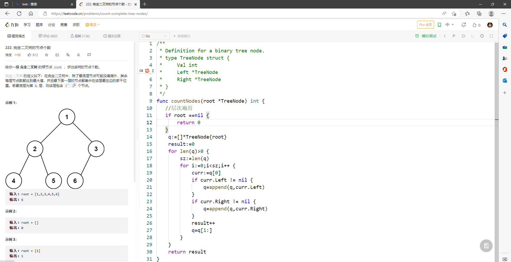
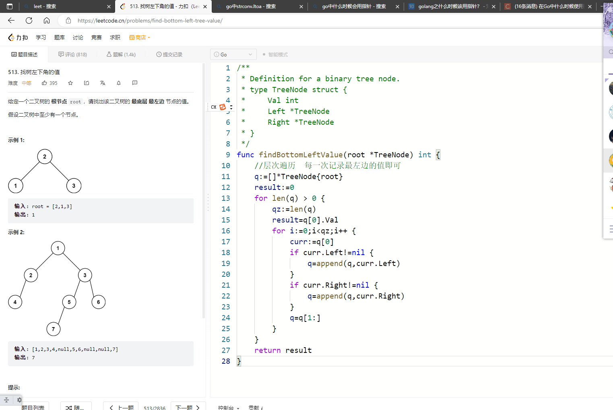

# 数组

## 1.二分查找

求数组长度 len(数组)   变量不要同时声明，没有while循环   使用 for达到同样效果  开头加上退出条件

if循环 必须连着写

## 2.移除个别元素

双指针

错误总结

goland里没有这种操作

简介写法

直接使用for range  

前面_代表索引 不需要索引  后面为当前值

## 3.螺旋矩阵

注意点

切片的使用

二维数组求长度

多个变量声明

# 链表

## 1.移除链表元素

算法思路  pre curr   注意当curr等于val进行处理  细节别处理搓

语法总结：头指针 必须取地址   使用{} 进行初始化  指针空值一般是

## 2.删除链表倒数第n个节点

注意取地址

## 3.链表相交

注意for循环 

## 4.反转链表

注意断开头结点

## 5.环形链表入口

## 6.设计链表

注意点

结构体中的指针

construct中返回的是指针类型

挂载方法是 注意参数是指针

## 7.有效的变位池

重点

判断字符串和数组相等都可以用==

for range 遍历 k,v:=s   前一个是索引，后一个是值

## 8.查找共用字符串

重点：

切片 [:] 将整个都切下来

for range 只有一个参数就是索引

## 9.两数之和

注意最后的进位，直接申请新节点来连接

# hash表

## 1.两数之和

map的使用必须使用make

v，ok  判断是否有key值

## 2.赎金信

for range的使用

## 3.反转字符串

多使用range语句

## 4.替换空格

重点

切片的使用

[] byte("%20")... 代表把着整个切片传入

# 栈和队列

## 1.用栈实现队列

重点：

切片的使用  需要注意

当模拟出栈时  去掉栈最后元素 我们利用切片 切刀倒数第二个元素接口 [: len-1]

模拟入栈 使用append（切片,x）

go中Constrcutor 就是类似够着函数

## 2.队列实现栈

思路：

每次将前n-1又放到尾巴上 然后取第一个

需注意top 取队列第一个后 要将其重新放回尾巴处

# 二叉树

## 1.二叉树三种遍历

前序遍历  

递归

注意初始化问题

## 2.二叉树成次遍历

注意切片声明

还有二维数组的插入

## 3.反转二叉树

## 4.对称二叉树

递归 注意整棵树

## 5.二叉树的最大深度

注意go中没有max函数 需要自己写

## 6.二叉树最小深度

需要注意一边为空时

## 7.完全二叉树的节点个数

​	递归

层次遍历

## 8.平衡树

计算深度  深度为-1 代表不是

## 9.找到所有路径

注意数字转化字符串

还有指针问题

## 10.二叉树左叶子节点和

## 11.二叉树的左叶子

## 12.路径总和

## 13.合并二叉树

之前写复杂啦 有一个为空 直接返回另一个  即可  下面的就不要关啦

## 14.验证二叉搜索树

依赖中序遍历

## 15.二叉搜索树最小绝对差

注意函数的声明类型

可以在主函数中直接声明 然后在初始化  在调用

# 字符串

## 1.反转字符串II

使用切片传入函数，切片的更改比较容易

最后在转变为字符串

# 回溯

## 1.组合

两个问题

1.在这里使用全局变量不要直接初始化 会影响下一次函数运行

2.path插入result时注意，我们需要新拷贝一个切片，复制内容（必须使用copy），因为path全局只有一个，他会把最后的4，4加入，导致结果都是最后一个4

## 2.电话组合

重点分析

使用字符数组村电话号码对于

第二个：

index代表访问第一个字符

根据获取的第几个字符字符串中取需要的abc即可

注意点：拼接最后的结果需要string 强转一下

