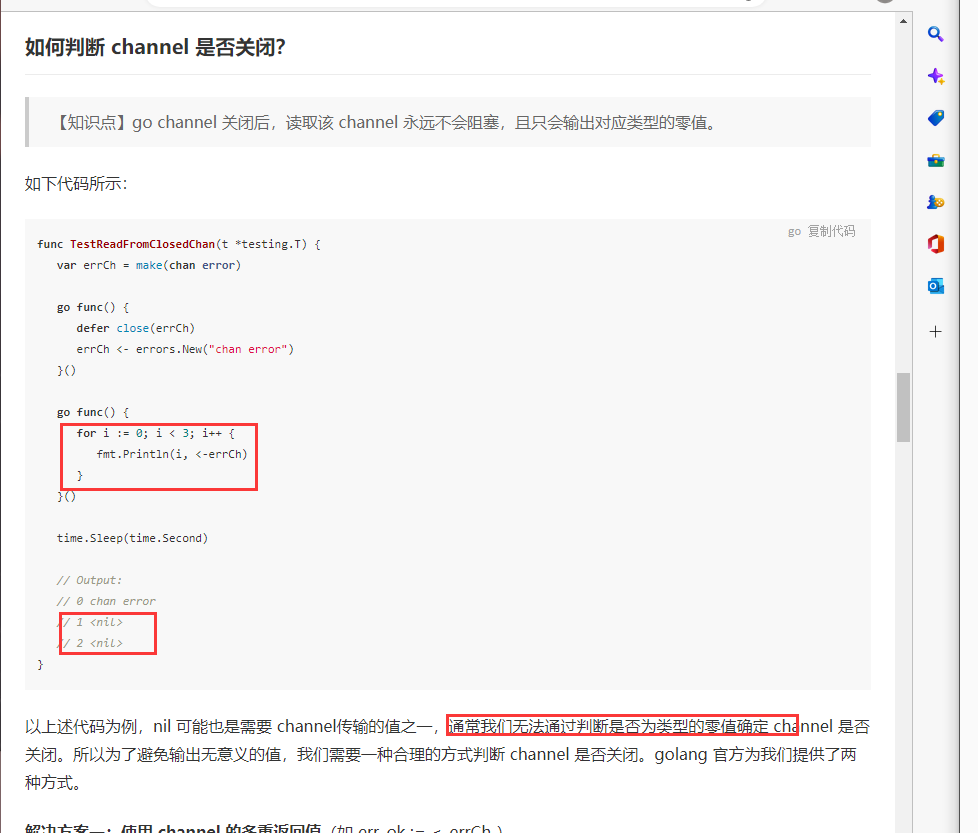
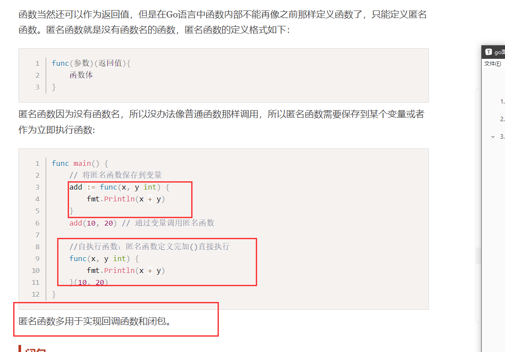
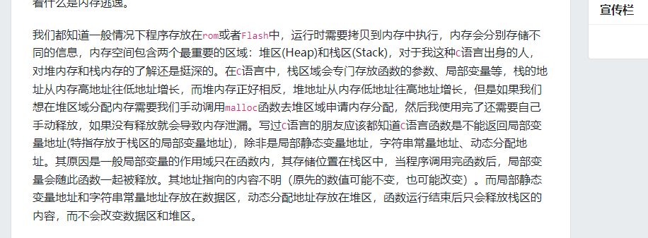
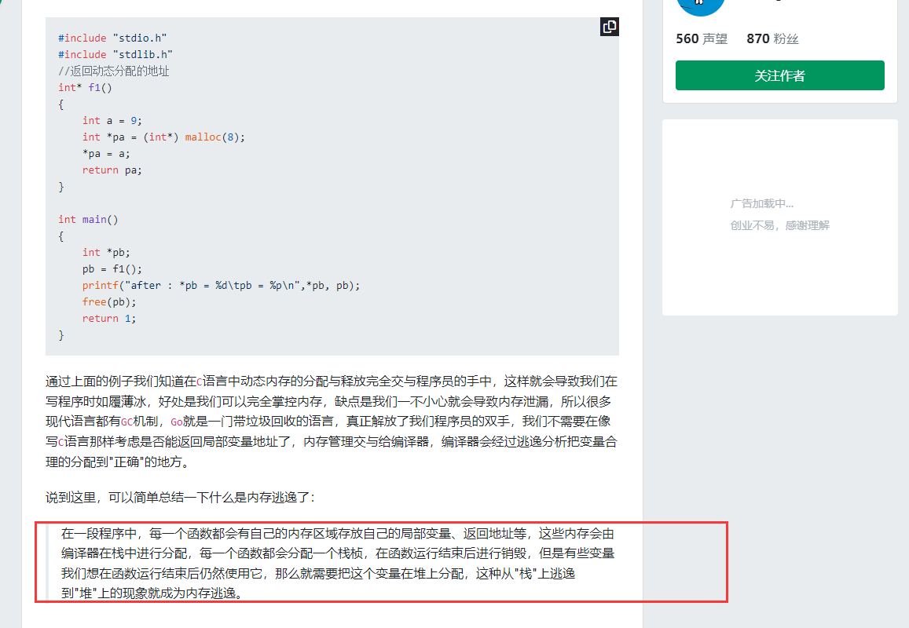

# 1.GMP调度

学习网站

[Golang并发调度的GMP模型 - 掘金 (juejin.cn)](https://juejin.cn/post/6886321367604527112)


1.协程介绍


3.GMP模型

采用类似之前操作系统所学的n：m的模式


4.调度模型


重点：


调度解析


G协程任务

M内核线程

P调度管理


两个高效的原因

work steal 和handl of

w:M没有从本地 获取G 会从本地拿G，本地没有就从其他本地队列偷G

h：当发生系统调用，M会阻塞，解绑M和P，此时会新创建或者找空闲M再去绑定P，用户是用户阻塞，M会放弃当前G，找其他G执行。


高校的原因：


# 2.基础语法面试题

语法面试题汇总

[Go 语言笔试面试题(基础语法) | 极客面试 | 极客兔兔 (geektutu.com)](https://geektutu.com/post/qa-golang-1.html#Q1-和-的区别？)


# 3.Go经典面试题


## 数据类型

### 1.基本数据类型


1.整型分为无符号和有符号类型，

int8，int16，int32，int64 其实就是代表结构字节

2的8次也就是一个字节对应byte


2.特殊整形

int 和unit 不同操作系统上充当不同类型


3.浮点类型

float32和float64


字符串常用操作


byte和rune类型

Go语言的两种字符类型


示例

可以看到byte显示的都是ascii码


重点：修改字符串

必须要转换为byte数组或者rune数组才能进行修改


## chan

### 1.chan的基本使用

channel示例

channel类型


例子


异常情况提示


无缓冲通道阻塞问题

我们创建没有缓冲的通道，通道必须要有接受方才能发送数据到通道，所以形成死锁，通道要等接受放，但是等来的确实发送方。


总结：无缓冲通道必须要又一个接受方才行。

流程解析：

接受发要又发送方发送值才能开始接受值，发送方必须要等通道又接受方才能发（做同步操作）


有缓冲的通道就能解决当前问题


forrange接收值快一点


单向通道


select多路复用


案例


### 2.chan使用注意事项

channel有三种状态

nil:对应map。slice，channel引用类型，只是声明为初始化，默认为nil

active：正常的channel，可读可写

close，已关闭，关闭后的channel值不是nil


1.无缓冲通道（同步），有接受者，发送者才能发，不然会造成死锁

示例：先发送到无缓冲，在接受，由于没有接收者，这边就一直发送不过去，造成死锁

这里就一直会卡到1


解决方案两种：要么通道是有缓冲的，要么有接受者，这里并不是说接受者要放在发生在前面，只要并发开一个协程有接受者即可


开一个协程作为接收者，一定要脱离程序是上到下执行的固执观念.

注意关闭channel

否


2.有缓存通道，写啦不顾那


### 3.chan关闭注意事项


文章

[go channel 关闭的那些事儿 - 掘金 (juejin.cn)](https://juejin.cn/post/7033671944587182087)


四种关闭管道会造成错误

1.未初始化直接关闭，直接报panic


2.重复关闭管道


3.关闭后在发送，报paninc


4.发送时关闭


总结规律

1.应该只在发送端关闭，避免关闭后又发送

2.存在多个发送者，不要关闭发送者channel，使用串门的stop channel，因为不可能同时关闭多个发送者，否则造成重复关闭。


channel一定要选择关闭吗？

1.channel的发送次数等于接收次数，此时管道会没有代码使用，被自动回收，不关闭没有任何副作用


2. chanel的发送次数大于/小于接受次数，造成接受一直阻塞等


如何判断channel是否关闭？

错误意识：认为使用nil值来判断。

分析：未初始化的channel是nil值，关闭后的channel接受也是nil，nil也有可能是要传输的值。




1.接受的时候使用多重返回值 value,ok=<-err;ok形式 已关闭返回true


2. for range 遍历

会自动判断关闭


## 协程、

### 1.进程，线程，协程

总结：

1.进程：一段运行的程序，比如QQ，微信，重点：资源分配的最小单位，创建进程，需要给其分配比如虚拟内存

2.线程，进程中一段执行的流程，多线程有效的提高啦并发处理，创建线程时子需要提供他需要的栈，寄存器和栈，线程共享进程的资源比如内存，切换代价笑

3.协程，给每一个人物分配一个线程还是不太好，资源有点浪费，协程即用户级线程，创建销毁由用户态决定，切换更高效，gorountine即go语言实现的协程。


### 3.go中如何实现同步的

1.使用waitGroup

流程分析

1.新开一个go fun（）时，wg.add(1)通知其他人，有一个协程开啦，

2.main线程或其他线程需要等待，wg.wait

3.当前go func执行完成时，wg.Done 通知一下


2.加锁 unlock（效率比较低）

注意两种锁

读锁和写锁

读锁可允许多个一起获取锁，读取内容

写锁只能一个获取


注意读写锁也是冲突的

可以同时读，新来的写必须等读全部读完才可以


写锁示例

Lock


Rlock


3.channel管道

上文已有，不在赘述


## 切片

### 1.基本使用


原理

切片包含三个：底层数组的指针，长度，以及容量

通过移动指针获取对应起始值


2.判断切片是否为空

使用len（s） ==0 不要使用nil

3.切片不能直接比较


4.切片的赋值拷贝

重点，这里类似指针的概念，我修改啦一个，另一个也会变动，项目中用到啦拷贝，给其他远程节点返回切片的拷贝，就不会修改原来值


拷贝


### 2..切片与指针

解惑

[切片传递与指针传递到底有啥区别 - 知乎 (zhihu.com)](https://zhuanlan.zhihu.com/p/315386899#:~:text=在Go的源码库或,，而非切片类型。)

总结抛出：go里面只有值传递没有引用传递，对于map，slice引用类型，也是值拷贝，指针也是值拷贝


1.切片传递和指针传递

问题抛出

函数里面修改值，切片就可以，为什么还要切片指针


如果函数内触发扩容机制，append的数没有加进去


首先说结论

如果只是修改值比如，nums[0]=1,切片足够，如果在里面append，必须切片指针


原理剖析

示例：一个string切片

array指向底层数组的指针


传入切片参数，此时就是拷贝当时切片的值，不是地址拷贝，清楚看到两个切片地址不一样，所以明显不是地址拷贝（引用传递）。

此时你更改元素值，肯定能改


此时一旦发送扩容，函数里面array指向新的数组，当函数结束，append的值也就改不了。


结论


如果传入的是切片指针

之前误区  吧切片想像太复杂，使用指针切片实际也是比较复杂一点数据类型


当外面传入切边指针时，值拷贝，我们得到切边指针的拷贝值，函数里面扩容时就可以不会出现之前的情况。


这里指针时指向普通变量，我们吧指向改为切片类型就明白啦


总结：

没有引用传递。


### 3.切片原理剖析


### 4.切片的扩容机制


结论：

1.当需要容量超过原切片容量的两倍时，直接用所需容量为新容量

2.当切边长度小于1024，新切片容量会翻倍，大于1024时，会反复增加百分之25，直到满足


https://blog.csdn.net/ljlinjiu/article/details/88852863)


### 12.切片的两种遍历方式


网站解析

[(16条消息) golang中遍历切片_人生30一道坎的博客-CSDN博客_golang 遍历切片](https://blog.csdn.net/ens160/article/details/120221623)


1.for i 能控制遍历的起点 以及i+的次数 比如i+=2  重点。可以改变切片里的值


2.for range 遍历  ，两个参数，index，value 前面索引后面值，也可以通过res[index]取值，重点，value是元素值的拷贝

可以看到通过更改value没办法更改切片值


地址打印，发现value地址，和切片本身元素地址不是同一个


## new 和make的区别

问题抛出

初始化

1.一般用于基本数据类型

new返回的是基本数据类型的地址


使用案例

指针变量必须给他初始化


2.make一般用于mao slience channnel 的内存创建，返回的就是这三个类型本身，这三个本来就是引用类型，不


区别


## 函数


接口型参数

参数是一个接口，只要当一个结构体实现接口的方法，就能传入函数中使用，类似java中的多态。


回调函数

[(16条消息) GO语言回调函数_callmejustin7的博客-CSDN博客_go语言回调](https://blog.csdn.net/callmejustin7/article/details/109564712)


函数作为参数和返回值


2.匿名函数的使用


## 值传递

结合这篇文章看


[(16条消息) Golang中引用传递理解_specterofblog的博客-CSDN博客_golang 引用传递](

## map


### 1.map的基本使用

首先重点

map不是线程安全的

基本使用

1.创建必须初始化

2.取值


如果取取不存在的值，


3.遍历方式  key，value形式，不想要的用_ 代替


4.delete删除


5.拷贝


类似切片 对一个的修改会影响另一个，因为底层指针问题


### 2.map重点讲解

1.map底层结构

与切片类似，底层有一个指向hmap的指针


2.map是一个引用类型

我们只是改变map里面元素的值，使用map本身就够，不是因为时引用传递，而是类似切片，底层指针指向同于个内容。


所以进行值拷贝时注意，下面的修改影响上面的


3.不保证顺序遍历


4.线程不安全（重点）

原因：官方认为不太需要线程安全

示例：同时开两个协程写map造成线程不安全


如何解决map线程安全

方法一：使用读写锁，读和写都会阻塞。


方法2：使用go提供的sync.map，对读不锁，写锁。


### 3.map底层刨析（重点）

扩容


1.设计原理

hash函数计算在那个桶


2.hash冲突问题

类似java，我们如何解决不同key映射到相同桶的问题


第一种解决方案，开发寻址法（效率差）

首先通过hash%哈哈hash表长度，计算应该落到key1的位置，发现key1以及被占用啦，就只能往其后面找空位，这里示例往下面举行找啦两下看到空的就进行插入


访问key3时，一开始index也还是落到key1，然后在一一进行比较。

缺点很显然，key越多，其就可以要一直遍历到末尾、


拉链法：类似java的map，链表


流程

类似java中，首先根据hash计算在那个桶，然后根据key再去一一比较，找到相同的key，覆盖其内容，一直找不到直到末尾添加新的即可。


读数据


3.装载因子


4.详细讲一下插入的时候如何快速对比key

bmap就是一个hash桶，tophash是hash函数的高8位。

这里类似java，先比较tophash，tophash不一致那肯定不是相同key值，tophash一致代表可能是同一个key，在进行key比较，相同覆盖，不同继续往下面走，通过tophash位运算，这样子大大减少啦我们直接用key比较效率。


5.map结构


重点：溢出桶。作用就是备用桶，减少扩容。


6.map扩容

两种扩容方式，等量扩容和翻倍扩容


等量扩容：

发生情况：当我们之前使用太多溢出桶，然后删除啦很多key数据，那此时这些溢出桶就一直空着没用，造成内存泄漏。

解决方案：等量搞一个hash表，把之前桶还剩的数据传过去，之后吧老的桶删除即可


翻倍扩容：

发生情况：扩载因子超过6.5啦，key数据太多。

解决方案：两倍的扩容一个hash表，这样子的目的是可以将原本一个桶的key分流到两个桶当中。


## 闭包


1.匿名函数





闭包

1.类似常规函数使用全局变量

这里n能直接用到匿名函数中。不用像以前一样传参数，直接用在函数里


2.闭包作为函数返回值


、

## 反射


### 反射基本使用

1.type of

通过reflect包的typeOf可以获取任意值的类型对象，类似java中的类对象，还有注意一般函数里面，我们用空接口来接受任意类型参数，类似java中的顶级父类。


2.type name  和type kind

type类型，kind种类就是底层的类型


示例

这里结构体，type就是person类型，kind就是底层struct类


3.ValueOf

reflect.Valueof用于获取对象的值


注意如果要将reflect获取的value转变为对应的基本类型进行。

通过获取的类对象v,Int()获取值，然后进行类型强转即可


4.通过反射设置变量的值（重点）

首先一样通过空接口接受任意参数，这里需要注意，由于参数的传递是值拷贝，我们想在里面改参数的值，必须使用v.Elem()获取指针对应的值。而且参数也必须传地址过来。


5.isNil() 和isVaild()


### 结构体反射（重点）

类似java，通过类对象获取结构体的成员和方法

1.获取方法，Numfiled和Filed


2.structFiled类型


反射示例：


反射的缺点


## 结构体

### 1.结构体基本使用

1.使用type


2.初始化

没有初始化的值就是该类型的零值


3.值类型和指针类型接受者

需要改值，或者接受者是拷贝代价比较大的对象


4.如何实现继承关系

结构体套别人的指针


### 结构体重点

1.结构体访问权限问题


两个结构体之间的比较

1.两个结构体能比较，只要他们属于同一个结构体初始化，而且成员里面没有引用类型。


这里指的是能否比较，比较的结构就是具体看啦，如这里使用指针（非引用），能比较但是地址不相同，结果不等（因为用啦new运算）


2.有引用类型（map，slience，channel）


3.不同结构体，相同值


强转类型可以比较


4.同一个结构体有引用类型非要比较，利用反射

reflect.DeepEqual判断两个值是否深度一致


## 接口

### 接口重点

1.类型断言

一个接口类型 指向其子类，我们就要用这个接口类型的对象，要先类型判断一下。


2.底层结构

有一个itab的指针


## 通信协议

### protobuf对比json


首先性能方面

protobu要比json高的多

原因：

json格式：


protobuf

把字段信息省去，使用tag|leg|value来表示信息

首先tag（占用一个字节），其含有数据类型和字段序号，匹配速度快（两边规定好字段序号对应），值是空的就不传，通过类型对比放入正确的位置，leg是长度，做字符串匹配更快。


优缺点：

protobuf快，但是json可读性更好


## 栈和堆

简单总结


栈区：比如我们函数的局部变量放在栈中，当函数执行完销毁局部变量，入栈都是满足先进，出栈（销毁）满足后出

堆区：

自己动态分配的，比如new和make，




## 内存逃逸分析

1.什么是内存逃逸

如下面的例子中，一般来说，每一个函数都会给其分配一个方法栈，局部变量这种就是在栈去，当函数消亡时也跟着消亡，但是如果我们返回的是一个动态分配的地址，目的就是函数结束之后还想去使用他，那就需要把这个变量分配到堆区，这种从栈上逃跑到堆上的行为就是内存逃逸。





2.内存逃逸分析

目的：虽然会有GC来处理堆上分配的内容，但是堆上内容如果太多，GC压力也大，所以内存逃逸分析就是想方设法的减少在堆上的内存分配。


逃逸分析的例子

1.返回一个局部变量的地址，此时方法栈以及销毁，为了外部使用这个地址，把res通过逃逸分析分配到对上


2.interface类型逃逸

当我们函数参数是接口时，由于编译器无法确定类型，会发生逃逸，但是这里只是str的值逃逸到堆上，因为我们我们用其引用。


如果使用啦引用地址。


3.闭包产生的逃逸

由于函数也是一个指针类型，所以把韩所当返回值也发生逃逸，匿名函数只能使用外部变量n，这个n会随着in被销毁，所以n变量逃逸到堆上


4.空间大小不确定或者栈空间不足时引发逃逸

比如当我们初始化切片，没有指定大小，为了保证内存安全（因为分配到栈上不知道具体多少）,所以分配到堆上。


# 3.并发编程题


## 1.闭包传参数问题

1.问题抛出


这里为什么结果都是3

原因1：首先我们要理解for循环里的i=1，i=2是同一个地址i


原因2：main线程和go线程并发问题

main线程太快啦，i已经变为3啦，此时才将i放进去3个go线程，当然输出结果都是3


解决方案：‘

闭包

我们清楚看到,i:=i,之后下面的i拥有一个新的地址，不管main再怎么快，这个副本也能拿到函数里


运行成功


## 2.交替打印序列问题

12AB34CD

1.直接使用无缓冲管道交替打印

三个管道

利用 接受发要有数据才能接受这种性质来完成同步


2.select解决

重点在于wg的使用。


这里不用*wg 是因为go提供啦这种语法糖，参数是 * 里面的wg可以不用在*，


3.使用有缓冲通道+wait来写，把函数抽象出来（这种写法非常优雅）


## 3.交替打印奇数和偶数


1.第一种写法 使用无缓冲通道，

错误造成死锁

原因，无缓存通道先要有接收者，发送这才能取发送数据，这里我发送数据到ch1，但是ch1目前没有接受者，所以就会造成死锁，一般来说无缓冲做同步操作（写和读必须同时），有缓冲做异步操作（写和读不用同时）。

第二个不好的点，i的遍历不好，最好都要设置为一样，最好不容易造成死锁


2.使用有缓冲通道来写

使用两个有缓冲的通道ch1，和ch2，不要像之前一样每次都+=2，直接i++，然后判定一下i是不是奇偶数，这样子写可能发生死锁概率小一点。


## 4.多线程买票问题


错误写法

1.忘记加上for循环，要不断买票

2.结束边界处理错误，这里我有一个窗口没票啦，就通知一下，然后return，这样子当前窗口关闭啦，但是对于其他窗口，此时管道里面没有任何的数据，就会一直阻塞，造成死锁


解决方案1（不够优雅）：

退出当前窗口时，再把0票数写入管道即可，这样子其他人也就能正常都读到管道票数为0


解决方案2.


# 4.手写lru

 

易错点总结：

moveToHead分两步

1.removenode（node）删掉当前

2.Addnode  再去添加


```java
type LRUCache struct {
   size     int
   capacity int
   cache    map[int]*DlinkedNode
   //保存一个头尾节点 tail专门用来淘汰节点 head是get或者add时用到
   head, tail *DlinkedNode
}
type DlinkedNode struct {
   key       int
   value     int
   pre, next *DlinkedNode
}

// 初始化，指定内存大小，给链表生产一个虚拟头节点和一个虚拟尾节点 并连接起来
func Constructor(capacity int) LRUCache {
   l := LRUCache{
      capacity: capacity,
      cache:    make(map[int]*DlinkedNode),
      //注意使用new初始化这两个指针
      head: new(DlinkedNode),
      tail: new(DlinkedNode),
   }
   //虚拟头尾节点相连
   l.head.next = l.tail
   l.tail.pre = l.head
   return l
}

// 找不到返回-1 查找某个key
func (this *LRUCache) Get(key int) int {
   //map里面查找，查不到
   node, ok := this.cache[key]
   if !ok {
      return -1
   }
   //查找相当于访问 要把节点放在头部
   this.moveTohead(node)
   return node.value
}

// Put修改 对于key的缓存大小
func (this *LRUCache) Put(key int, value int) {
   //先查 有没有 没有就新建一个
   if _, ok := this.cache[key]; !ok {
      //新建一个node节点
      node := &DlinkedNode{
         key:   key,
         value: value,
      }
      //添加到map中
      this.cache[key] = node
      //移动到对头  size++
      this.size++
      this.addTohead(node)
      if this.size > this.capacity {
         //移除队尾节点
         this.size--
         curr := this.removeTail()
         //删除map映射
         delete(this.cache, curr.key)
      }
   } else {
      //已经有的
      node := this.cache[key]
      //移动队头
      this.moveTohead(node)
      //修改value
      node.value = value
   }
}

// 链表辅助操作
// 淘汰尾巴节点：ramoveTail  依赖于removeNode(移除某个节点)
// 这里只是把函数功能更加解耦 一个函数也能做
func (this *LRUCache) removeTail() *DlinkedNode {
   //传入尾巴节点 注意tail是最后一个虚拟尾节点
   node := this.tail.pre
   //删除node
   this.removeNode(node)
   //返回被删除节点 之后还要用它
   return node
}
func (this *LRUCache) removeNode(node *DlinkedNode) {
   //双向链表 删除更加容易  直接通过 pre next找到其前驱和后继节点
   node.pre.next = node.next
   node.next.pre = node.pre
}

// 移动到队头
// 也是分为两部  moveTohead  1.removenode首先删除节点当前所在位置 2.addnode然后添加节点到头部
func (this *LRUCache) moveTohead(node *DlinkedNode) {
   //移除当前节点
   this.removeNode(node)
   //将节点添加到头部
   this.addTohead(node)
}
func (this *LRUCache) addTohead(node *DlinkedNode) {
   //head是虚拟头节点  这里我们将node节点插入到head后面即可
   //temp保留一下head后继节点
   temp := this.head.next
   //前驱
   this.head.next = node
   node.pre = this.head
   //后继
   node.next = temp
   temp.pre = node
}
```
