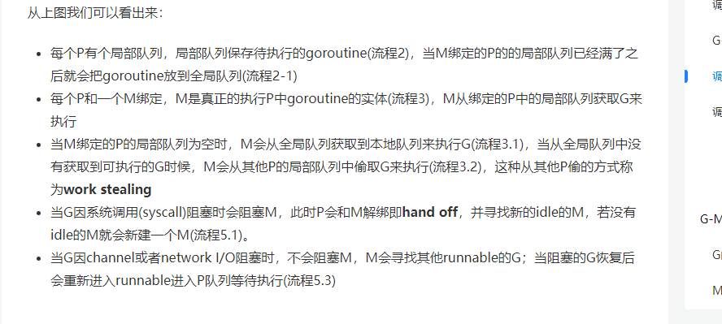
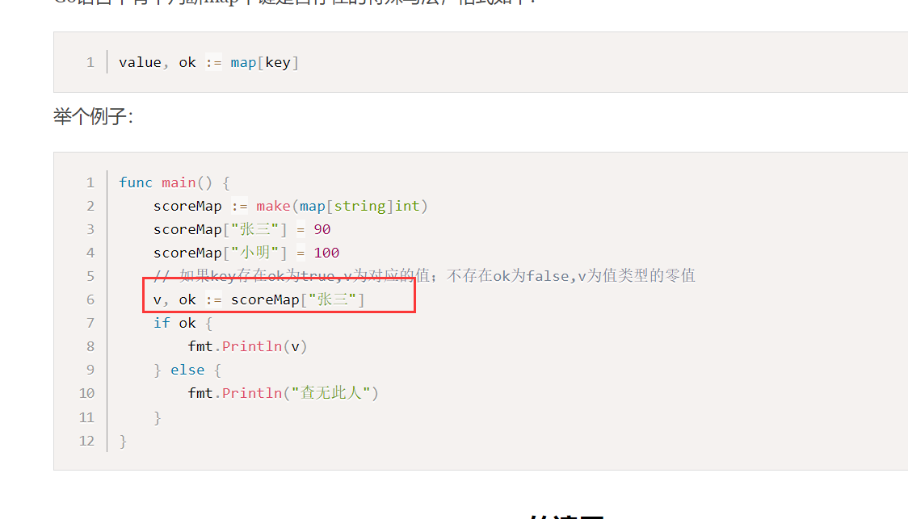
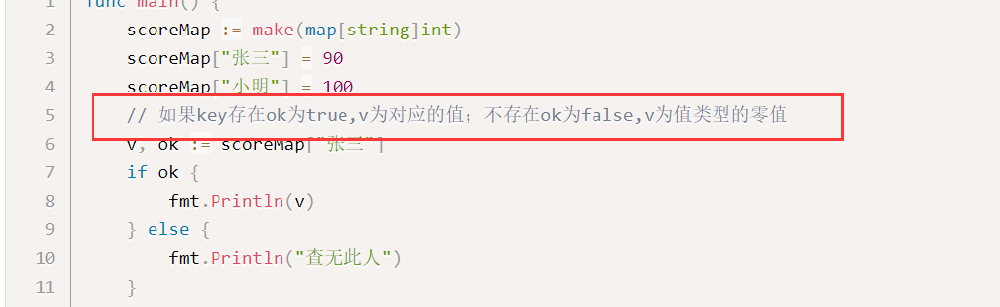
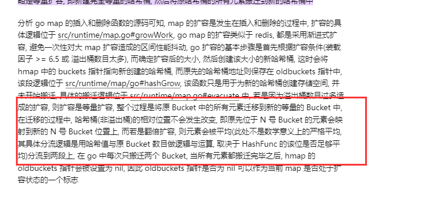

# 1.GMP调度

学习网站

[Golang并发调度的GMP模型 - 掘金 (juejin.cn)](https://juejin.cn/post/6886321367604527112)

1.协程介绍

3.GMP模型

采用类似之前操作系统所学的n：m的模式

4.调度模型

重点：

调度解析

G协程任务

M内核线程

P调度管理

两个高效的原因

work steal 和handl of

w:M没有从本地 获取G 会从本地拿G，本地没有就从其他本地队列偷G

h：当发生系统调用，M会阻塞，解绑M和P，此时会新创建或者找空闲M再去绑定P，用户是用户阻塞，M会放弃当前G，找其他G执行。

高校的原因：

# 2.基础语法面试题

语法面试题汇总

[Go 语言笔试面试题(基础语法) | 极客面试 | 极客兔兔 (geektutu.com)](https://geektutu.com/post/qa-golang-1.html#Q1-和-的区别？)

# 3.Go经典面试题

## 1.chan

### 1.chan的基本使用

channel示例

channel类型

例子

异常情况提示

无缓冲通道阻塞问题

我们创建没有缓冲的通道，通道必须要有接受方才能发送数据到通道，所以形成死锁，通道要等接受放，但是等来的确实发送方。

总结：无缓冲通道必须要又一个接受方才行。

流程解析：

接受发要又发送方发送值才能开始接受值，发送方必须要等通道又接受方才能发（做同步操作）

有缓冲的通道就能解决当前问题

forrange接收值快一点

单向通道

select多路复用

案例

### 2.chan

## 2.协程、

### 1.进程，线程，协程

总结：

1.进程：一段运行的程序，比如QQ，微信，重点：资源分配的最小单位，创建进程，需要给其分配比如虚拟内存

2.线程，进程中一段执行的流程，多线程有效的提高啦并发处理，创建线程时子需要提供他需要的栈，寄存器和栈，线程共享进程的资源比如内存，切换代价笑

3.协程，给每一个人物分配一个线程还是不太好，资源有点浪费，协程即用户级线程，创建销毁由用户态决定，切换更高效，gorountine即go语言实现的协程。

## 3.go中如何实现同步的

1.使用waitGroup

流程分析

1.新开一个go fun（）时，wg.add(1)通知其他人，有一个协程开啦，

2.main线程或其他线程需要等待，wg.wait

3.当前go func执行完成时，wg.Done 通知一下

2.加锁 unlock（效率比较低）

注意两种锁

读锁和写锁

读锁可允许多个一起获取锁，读取内容

写锁只能一个获取

写锁示例

Lock

Rlock

3.channel管道

上文已有，不在赘述

## 4.切片

### 1.基本使用

原理

切片包含三个：底层数组的指针，长度，以及容量

通过移动指针获取对应起始值

2.判断切片是否为空

使用len（s） ==0 不要使用nil

3.切片不能直接比较

4.切片的赋值拷贝

重点，这里类似指针的概念，我修改啦一个，另一个也会变动，项目中用到啦拷贝，给其他远程节点返回切片的拷贝，就不会修改原来值

拷贝

### 2..切片与指针

解惑

[切片传递与指针传递到底有啥区别 - 知乎 (zhihu.com)](https://zhuanlan.zhihu.com/p/315386899#:~:text=在Go的源码库或,，而非切片类型。)

总结抛出：go里面只有值传递没有引用传递，对于map，slice引用类型，也是值拷贝，指针也是值拷贝

1.切片传递和指针传递

问题抛出

函数里面修改值，切片就可以，为什么还要切片指针

如果函数内触发扩容机制，append的数没有加进去

首先说结论

如果只是修改值比如，nums[0]=1,切片足够，如果在里面append，必须切片指针

原理剖析

示例：一个string切片

array指向底层数组的指针

传入切片参数，此时就是拷贝当时切片的值，不是地址拷贝，清楚看到两个切片地址不一样，所以明显不是地址拷贝（引用传递）。

此时你更改元素值，肯定能改

此时一旦发送扩容，函数里面array指向新的数组，当函数结束，append的值也就改不了。

结论

如果传入的是切片指针

之前误区  吧切片想像太复杂，使用指针切片实际也是比较复杂一点数据类型

当外面传入切边指针时，值拷贝，我们得到切边指针的拷贝值，函数里面扩容时就可以不会出现之前的情况。

这里指针时指向普通变量，我们吧指向改为切片类型就明白啦

总结：

没有引用传递。

### 3.切片原理剖析

### 4.切片的扩容机制

结论：

1.当需要容量超过原切片容量的两倍时，直接用所需容量为新容量

2.当切边长度小于1024，新切片容量会翻倍，大于1024时，会反复增加百分之25，直到满足

## 6.值传递

结合这篇文章看

[(16条消息) Golang中引用传递理解_specterofblog的博客-CSDN博客_golang 引用传递](https://blog.csdn.net/ljlinjiu/article/details/88852863)

## 7.new 和make的区别

问题抛出

初始化

1.一般用于基本数据类型

new返回的是基本数据类型的地址

使用案例

指针变量必须给他初始化

2.make一般用于mao slience channnel 的内存创建，返回的就是这三个类型本身，这三个本来就是引用类型，不

区别

## 9.函数

函数作为参数和返回值

2.匿名函数的使用

## 10.map

### 1.map的基本使用

首先重点

map不是线程安全的

基本使用

1.创建必须初始化

2.取值

如果取取不存在的值，

3.遍历方式  key，value形式，不想要的用_ 代替

4.delete删除

5.拷贝

类似切片 对一个的修改会影响另一个，因为底层指针问题

### 2.map重点讲解

1.map底层结构

与切片类似，底层有一个指向hmap的指针

2.map是一个引用类型

我们只是改变map里面元素的值，使用map本身就够，不是因为时引用传递，而是类似切片，底层指针指向同于个内容。

所以进行值拷贝时注意，下面的修改影响上面的

3.不保证顺序遍历

4.线程不安全（重点）

原因：官方认为不太需要线程安全

示例：同时开两个协程写map造成线程不安全

如何解决map线程安全

方法一：使用读写锁，读和写都会阻塞。

方法2：使用go提供的sync.map，对读不锁，写锁。

### 3.map底层刨析（重点）

扩容

1.设计原理

hash函数计算在那个桶

2.hash冲突问题

类似java，我们如何解决不同key映射到相同桶的问题

第一种解决方案，开发寻址法（效率差）

首先通过hash%哈哈hash表长度，计算应该落到key1的位置，发现key1以及被占用啦，就只能往其后面找空位，这里示例往下面举行找啦两下看到空的就进行插入

访问key3时，一开始index也还是落到key1，然后在一一进行比较。

缺点很显然，key越多，其就可以要一直遍历到末尾、

拉链法：类似java的map，链表

流程

类似java中，首先根据hash计算在那个桶，然后根据key再去一一比较，找到相同的key，覆盖其内容，一直找不到直到末尾添加新的即可。

读数据

3.装载因子

4.详细讲一下插入的时候如何快速对比key

bmap就是一个hash桶，tophash是hash函数的高8位。

这里类似java，先比较tophash，tophash不一致那肯定不是相同key值，tophash一致代表可能是同一个key，在进行key比较，相同覆盖，不同继续往下面走，通过tophash位运算，这样子大大减少啦我们直接用key比较效率。

5.map结构

重点：溢出桶。作用就是备用桶，减少扩容。

6.map扩容

两种扩容方式，等量扩容和翻倍扩容

等量扩容：

发生情况：当我们之前使用太多溢出桶，然后删除啦很多key数据，那此时这些溢出桶就一直空着没用，造成内存泄漏。

解决方案：等量搞一个hash表，把之前桶还剩的数据传过去，之后吧老的桶删除即可

翻倍扩容：

发生情况：扩载因子超过6.5啦，key数据太多。

解决方案：两倍的扩容一个hash表，这样子的目的是可以将原本一个桶的key分流到两个桶当中。

## 12.闭包

1.匿名函数

闭包

1.类似常规函数使用全局变量

这里n能直接用到匿名函数中。不用像以前一样传参数，直接用在函数里

2.闭包作为函数返回值

## 12.切片的两种遍历方式

网站解析

[(16条消息) golang中遍历切片_人生30一道坎的博客-CSDN博客_golang 遍历切片](https://blog.csdn.net/ens160/article/details/120221623)

1.for i 能控制遍历的起点 以及i+的次数 比如i+=2  重点。可以改变切片里的值

2.for range 遍历  ，两个参数，index，value 前面索引后面值，也可以通过res[index]取值，重点，value是元素值的拷贝

可以看到通过更改value没办法更改切片值

地址打印，发现value地址，和切片本身元素地址不是同一个

# 3.并发编程题

## 1.闭包传参数问题

1.问题抛出

这里为什么结果都是3

原因1：首先我们要理解for循环里的i=1，i=2是同一个地址i

原因2：main线程和go线程并发问题

main线程太快啦，i已经变为3啦，此时才将i放进去3个go线程，当然输出结果都是3

解决方案：‘

闭包

我们清楚看到,i:=i,之后下面的i拥有一个新的地址，不管main再怎么快，这个副本也能拿到函数里

运行成功

## 2.交替打印序列问题

12AB34CD

1.直接使用无缓冲管道交替打印

三个管道

利用 接受发要有数据才能接受这种性质来完成同步

2.select解决

重点在于wg的使用。

这里不用*wg 是因为go提供啦这种语法糖，参数是 * 里面的wg可以不用在*，

